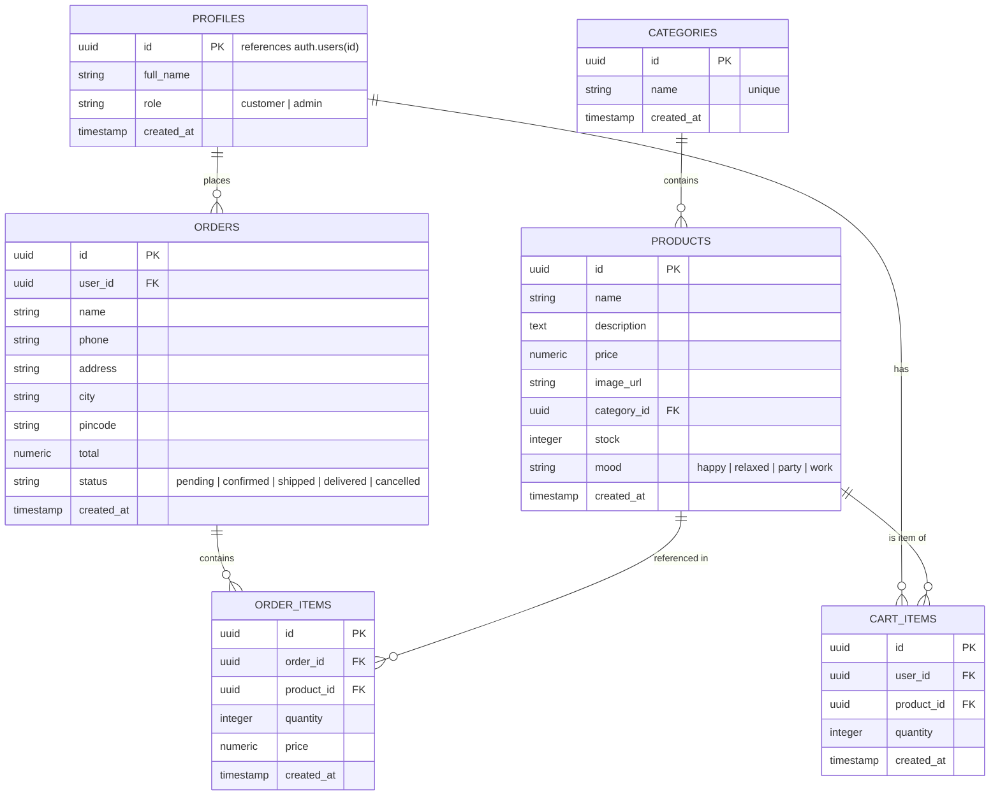

# MoodCart 🛒 — Full-Stack E-Commerce Architecture & System Guide

**MoodCart** is an end-to-end full-stack e-commerce web application where customers can discover products tailored to their emotional state or vibe (**Happy**, **Relaxed**, **Party**, **Work**), manage their cart across devices, and place orders. It also features a comprehensive **Admin Portal** for catalog and order fulfillment management.

---

## 📑 Table of Contents
1. [High-Level Architecture](#high-level-architecture)
2. [How the System is Connected (Data Flow)](#how-the-system-is-connected-data-flow)
3. [Project Directory & File Structure](#project-directory--file-structure)
4. [How Each Feature Works (End-to-End Workflows)](#how-each-feature-works-end-to-end-workflows)
   - [A. Authentication & Role-Based Access](#a-authentication--role-based-access)
   - [B. Product Browsing & "Shop by Mood"](#b-product-browsing--shop-by-mood)
   - [C. Shopping Cart Lifecycle](#c-shopping-cart-lifecycle)
   - [D. Checkout & Order Processing](#d-checkout--order-processing)
   - [E. Admin Management & Image Upload Pipeline](#e-admin-management--image-upload-pipeline)
5. [Database Schema & Relationships](#database-schema--relationships)
6. [REST API Reference](#rest-api-reference)
7. [Security & Protection Model](#security--protection-model)
8. [Setup & Local Development](#setup--local-development)

---

## 🏛️ High-Level Architecture

The application adopts a decoupled 3-tier architecture:

```mermaid
graph TD
    subgraph Client Layer ["Frontend (React + Vite :5173)"]
        UI[React UI Pages & Components]
        AuthCtx[AuthContext]
        CartCtx[CartContext]
        AxiosClient["Axios Interceptor (api.js)"]
        SupaClient["Client Supabase SDK (lib/supabase.js)"]
    end

    subgraph Server Layer ["Backend API (Node.js + Express :5000)"]
        Server[Express Server (server.js)]
        AuthMW[Auth Middleware (JWT Verify)]
        RoleMW[Admin Role Guard]
        Controllers["Controllers (Products, Cart, Orders, Categories)"]
        Multer[Multer Memory Storage]
        SupaAdmin["Backend Supabase SDK (Service Role)"]
    end

    subgraph Cloud Layer ["Supabase BaaS (PostgreSQL + Auth + Storage)"]
        SupaAuth["Supabase Auth (auth.users)"]
        DB[("PostgreSQL Database (RLS Enabled)")]
        Storage["Supabase Storage ('products' Bucket)"]
    end

    %% Client Auth
    AuthCtx -->|"Sign up / Sign in / Session Listener"| SupaAuth
    UI --> AuthCtx
    UI --> CartCtx

    %% Client to Backend
    CartCtx --> AxiosClient
    UI --> AxiosClient
    AxiosClient -->|"Bearer JWT + REST Requests"| Server

    %% Backend flow
    Server --> AuthMW
    AuthMW -->|"Verify Token via getUser()"| SupaAuth
    AuthMW --> RoleMW
    RoleMW --> Controllers
    Controllers --> SupaAdmin
    Multer -->|"Upload Image Buffer"| SupaAdmin

    %% Backend to Database & Storage
    SupaAdmin -->|"SQL Queries (Bypass RLS)"| DB
    SupaAdmin -->|"Image Storage API"| Storage
```

### Technology Matrix

| Layer | Technology | Primary Role |
| :--- | :--- | :--- |
| **Frontend** | React 18 + Vite | Single Page Application (SPA), reactive UI, state management |
| **Routing** | React Router v6 | Client-side routing with public and protected route guards |
| **HTTP Client** | Axios | REST client configured with dynamic JWT bearer token injection |
| **Backend API** | Node.js + Express | REST API, business logic, role verification, and cart/order coordination |
| **Database** | PostgreSQL (Supabase) | Relational data persistence, integrity constraints, and SQL triggers |
| **Authentication**| Supabase Auth | User identity management, session tokens, and metadata claims |
| **File Storage** | Supabase Storage | Public asset hosting for product catalog images |
| **File Upload** | Multer | Server memory buffer handling for admin image uploads |

---

## 🔗 How the System is Connected (Data Flow)

Here is how each layer talks to the other:

```
+-----------------------------------------------------------------------------------------+
|                                      FRONTEND                                           |
|                                                                                         |
|  1. Direct to Supabase Auth:                                                            |
|     frontend/src/lib/supabase.js <--------> Supabase Auth (Login/Signup/Tokens)        |
|                                                                                         |
|  2. To Backend API with JWT:                                                            |
|     frontend/src/services/api.js injects: Authorization: Bearer <session.access_token>  |
+--------------------------------------------|--------------------------------------------+
                                             | HTTP Requests (Port 5000)
                                             v
+-----------------------------------------------------------------------------------------+
|                                      BACKEND                                            |
|                                                                                         |
|  1. Middleware (middleware/auth.js):                                                    |
|     Calls supabaseAuth.auth.getUser(token) with ANON key to authenticate user.         |
|     Inspects req.user.user_metadata.role for admin actions.                             |
|                                                                                         |
|  2. Controllers (controllers/*.js):                                                     |
|     Uses SERVICE_ROLE_KEY (config/supabase.js) to query Supabase PostgreSQL.            |
|     Bypasses RLS safely on the server side to perform multi-table writes.               |
+--------------------------------------------|--------------------------------------------+
                                             | Secure TLS Database Connection
                                             v
+-----------------------------------------------------------------------------------------+
|                                    SUPABASE CLOUD                                       |
|                                                                                         |
|  - auth.users table holds user credentials & metadata                                  |
|  - PostgreSQL executes triggers (e.g. handle_new_user -> public.profiles)              |
|  - Tables: categories, products, cart_items, orders, order_items                        |
|  - Storage bucket: "products" holds uploaded catalog pictures                           |
+-----------------------------------------------------------------------------------------+
```

---

## 📂 Project Directory & File Structure

```
E-commeres/
├── backend/
│   ├── src/
│   │   ├── config/
│   │   │   └── supabase.js            # Initializes Supabase client with SUPABASE_SERVICE_ROLE_KEY
│   │   ├── controllers/
│   │   │   ├── cartController.js      # Cart CRUD (persisted per user)
│   │   │   ├── categoryController.js  # Category listings
│   │   │   ├── orderController.js     # Order placement, status transitions, retrieval
│   │   │   └── productController.js   # Product query/filter, CRUD, and image upload
│   │   ├── middleware/
│   │   │   └── auth.js                # authenticate & requireAdmin route guards
│   │   └── routes/
│   │       ├── cart.js                # /api/cart route definitions
│   │       ├── categories.js          # /api/categories route definitions
│   │       ├── orders.js              # /api/orders route definitions
│   │       └── products.js            # /api/products route definitions (with Multer)
│   ├── .env                           # Backend environment variables
│   ├── package.json                   # Backend dependencies & dev scripts
│   └── server.js                      # Express application entrypoint & middleware setup
│
├── frontend/
│   ├── src/
│   │   ├── assets/                    # Static assets & icons
│   │   ├── components/
│   │   │   ├── CartItem.jsx           # Individual cart row item with quantity stepper
│   │   │   ├── Navbar.jsx             # Top navigation with mood links, badge count & user menu
│   │   │   ├── ProductCard.jsx        # Product display card with mood tag & Add-to-Cart
│   │   │   ├── ProductList.jsx        # Grid layout wrapper for product cards
│   │   │   └── ProtectedRoute.jsx     # Route wrapper verifying login status and admin rights
│   │   ├── context/
│   │   │   ├── AuthContext.jsx        # User session, login, signup, logout state
│   │   │   └── CartContext.jsx        # Cart items state, total calculations, sync functions
│   │   ├── lib/
│   │   │   └── supabase.js            # Frontend Supabase client (Anon Key)
│   │   ├── pages/
│   │   │   ├── AdminPage.jsx          # Admin dashboard for products CRUD & order status updates
│   │   │   ├── CartPage.jsx           # Review shopping cart items and order total
│   │   │   ├── CheckoutPage.jsx       # Shipping form and order submission
│   │   │   ├── HomePage.jsx           # Landing page with mood selector & featured catalog
│   │   │   ├── LoginPage.jsx          # User sign in form
│   │   │   ├── OrderDetailPage.jsx    # Detailed view of an individual order and items
│   │   │   ├── OrdersPage.jsx         # Customer's past orders history
│   │   │   ├── ProductDetailPage.jsx  # Single product details, stock check, add-to-cart
│   │   │   ├── ProductsPage.jsx       # Catalog page with mood filter, search, & category pills
│   │   │   └── RegisterPage.jsx       # User registration form with profile info
│   │   ├── services/
│   │   │   ├── api.js                 # Axios instance with Supabase token interceptor
│   │   │   ├── cartService.js         # API calls to /api/cart
│   │   │   ├── categoryService.js     # API calls to /api/categories
│   │   │   ├── orderService.js        # API calls to /api/orders
│   │   │   └── productService.js      # API calls to /api/products
│   │   ├── App.css                    # Component-specific styles
│   │   ├── App.jsx                    # Routing table and context providers tree
│   │   ├── index.css                  # Global design tokens, themes, typography, layout
│   │   └── main.jsx                   # React DOM root entrypoint
│   ├── .env                           # Frontend environment variables
│   ├── index.html                     # HTML page template
│   ├── package.json                   # Frontend dependencies
│   └── vite.config.js                 # Vite bundler configuration
│
└── supabase/
    └── schema.sql                     # Complete PostgreSQL DDL, RLS policies, triggers & seeds
```

---

## ⚙️ How Each Feature Works (End-to-End Workflows)

### A. Authentication & Role-Based Access
1. **User Sign Up (`RegisterPage.jsx`)**:
   - The user enters name, email, and password.
   - Calls `supabase.auth.signUp()` with `data: { full_name, role: 'customer' }`.
   - In Supabase, the `handle_new_user()` PostgreSQL trigger fires on `auth.users`, inserting a matching record into the `public.profiles` table.
2. **Session Persistence (`AuthContext.jsx`)**:
   - `supabase.auth.onAuthStateChange` listens for login, token refresh, and logout events.
   - Saves `user` and `session` in React state.
3. **API Authorization (`api.js` & `backend/src/middleware/auth.js`)**:
   - Whenever an Axios call is made, the interceptor grabs the active JWT token via `supabase.auth.getSession()` and injects `Authorization: Bearer <token>`.
   - The backend `authenticate` middleware uses Supabase Anon client to verify the token: `supabaseAuth.auth.getUser(token)`.
   - If verified, `req.user` is attached to the request.
4. **Admin Protection**:
   - Frontend: `<ProtectedRoute adminOnly>` redirects non-admin users to the homepage.
   - Backend: `requireAdmin` checks `req.user.user_metadata?.role === 'admin'`. If mismatched, it rejects the request with HTTP `403 Forbidden`.

---

### B. Product Browsing & "Shop by Mood"
1. **Mood Tagging**:
   - Every product has a `mood` attribute: `'happy'`, `'relaxed'`, `'party'`, or `'work'`.
2. **Discovery (`HomePage.jsx` & `ProductsPage.jsx`)**:
   - Customers can click a mood button (e.g. "Relaxed") on the homepage or header.
   - `ProductsPage.jsx` sets query parameters `?mood=relaxed`.
3. **Backend Filtering (`productController.js`)**:
   - `GET /api/products?mood=relaxed&category=<id>&search=<query>`
   - The backend builds a dynamic Supabase query:
     ```javascript
     if (mood) query = query.eq('mood', mood);
     if (category) query = query.eq('category_id', category);
     if (search) query = query.ilike('name', `%${search}%`);
     ```
   - Returns matched products along with category metadata.

---

### C. Shopping Cart Lifecycle
Unlike standard localStorage carts, **MoodCart synchronizes the cart directly with the database**:
1. **Add Item (`CartContext.jsx` -> `cartController.js`)**:
   - Customer clicks "Add to Cart".
   - Sends `POST /api/cart` with `{ product_id, quantity }`.
   - Backend checks if `user_id` and `product_id` already exist in `cart_items`:
     - If yes: Increments `quantity`.
     - If no: Inserts a new row.
2. **Multi-Device Persistence**:
   - When the user logs in from any computer or browser, `CartContext` fetches `GET /api/cart` and populates their current cart immediately.
3. **Cart Operations**:
   - `PUT /api/cart/:id` updates item quantity.
   - `DELETE /api/cart/:id` removes an item from the database.

---

### D. Checkout & Order Processing
1. **Initiating Checkout (`CheckoutPage.jsx`)**:
   - Reads current items from `CartContext`.
   - User inputs recipient details: Name, Phone Number, Address, City, Pincode.
2. **Atomic Order Creation (`orderController.js -> createOrder`)**:
   - Calculates total price server-side from product quantities and prices.
   - **Step 1:** Inserts order record into `orders` table with status `'pending'`.
   - **Step 2:** Inserts individual rows into `order_items` linked to `order.id`.
   - **Step 3:** Automatically clears the customer's items from `cart_items`.
   - Returns the created order object.
3. **Order Tracking (`OrdersPage.jsx` & `OrderDetailPage.jsx`)**:
   - Displays real-time status badges: `pending` → `confirmed` → `shipped` → `delivered` (or `cancelled`).
   - Customers can only query their own orders; admins can query all orders across the system.

---

### E. Admin Management & Image Upload Pipeline
1. **Product CRUD (`AdminPage.jsx`)**:
   - Admins can create, edit, or delete any product.
2. **Product Image Upload**:
   - When an admin selects an image file from their computer, `AdminPage.jsx` sends it to `POST /api/products/upload-image`.
   - `multer` receives the image in server memory (`storage: multer.memoryStorage()`).
   - `productController.uploadProductImage` generates a unique filename (`products/${Date.now()}-${file.originalname}`) and uploads the buffer to the Supabase Storage bucket `'products'`.
   - Retrieves the public URL via `supabase.storage.from('products').getPublicUrl(path)` and returns it to auto-populate the form.
3. **Order Status Management**:
   - Admins can view customer orders and update the status dropdown to `confirmed`, `shipped`, `delivered`, or `cancelled`.

---

## 🗄️ Database Schema & Relationships



---

## 🌐 REST API Reference

All backend API routes are prefixed with `/api`.

### Products & Categories

| Method | Endpoint | Access | Description |
| :--- | :--- | :--- | :--- |
| `GET` | `/api/products` | Public | List products. Supports `?search=`, `?category=`, and `?mood=` |
| `GET` | `/api/products/:id` | Public | Get single product by UUID with category name |
| `POST` | `/api/products/upload-image` | **Admin** | Upload product image file (multipart/form-data) to Supabase Storage |
| `POST` | `/api/products` | **Admin** | Create new product |
| `PUT` | `/api/products/:id` | **Admin** | Update product properties (price, stock, mood, etc.) |
| `DELETE`| `/api/products/:id` | **Admin** | Delete a product |
| `GET` | `/api/categories` | Public | Get all categories |

### Cart Management

| Method | Endpoint | Access | Description |
| :--- | :--- | :--- | :--- |
| `GET` | `/api/cart` | Authenticated | Retrieve logged-in user's cart items with product details |
| `POST` | `/api/cart` | Authenticated | Add item to cart (`{ product_id, quantity }`) |
| `PUT` | `/api/cart/:id` | Authenticated | Update quantity of a cart item |
| `DELETE`| `/api/cart/:id` | Authenticated | Remove an item from the user's cart |

### Orders & Checkout

| Method | Endpoint | Access | Description |
| :--- | :--- | :--- | :--- |
| `POST` | `/api/orders` | Authenticated | Place new order, persist order items, and clear cart |
| `GET` | `/api/orders` | Authenticated | Customer: view own orders. Admin: view all orders |
| `GET` | `/api/orders/:id` | Authenticated | Retrieve full order detail with items |
| `PUT` | `/api/orders/:id/status` | **Admin** | Update order status (`pending`, `confirmed`, `shipped`, `delivered`, `cancelled`) |

### System

| Method | Endpoint | Access | Description |
| :--- | :--- | :--- | :--- |
| `GET` | `/api/health` | Public | Check if API server is running |

---

## 🔒 Security & Protection Model

1. **Separation of Keys**:
   - `VITE_SUPABASE_ANON_KEY`: Safe for frontend public exposure; queries are constrained by Supabase Row Level Security (RLS).
   - `SUPABASE_SERVICE_ROLE_KEY`: Kept **exclusively in the backend `.env`**. It never leaks to the browser bundle and is used for server operations that manage records across users.
2. **Row Level Security (RLS)**:
   - Enabled on all tables (`profiles`, `categories`, `products`, `cart_items`, `orders`, `order_items`).
   - Ensures clients accessing Supabase directly can never view or modify another customer's cart or orders.
3. **Backend Middleware Verification**:
   - Every protected route requires a valid JWT bearer token verified against `supabaseAuth.auth.getUser(token)`.
   - Admin routes strictly enforce `req.user.user_metadata?.role === 'admin'`.

---

## 🚀 Setup & Local Development

### 1. Prerequisites
- **Node.js**: version 18 or above
- **Supabase Account**: A free project created on [supabase.com](https://supabase.com)

---

### 2. Database Initialization
1. In the Supabase project dashboard, navigate to **SQL Editor**.
2. Open and paste the contents of `supabase/schema.sql`.
3. Click **Run**. This will create:
   - All tables and constraints
   - `on_auth_user_created` trigger
   - Row Level Security (RLS) policies
   - Default categories and sample products

---

### 3. Backend Configuration & Startup
```bash
# Navigate to backend
cd backend

# Install dependencies
npm install

# Create environment configuration
cp .env.example .env
```

Configure `backend/.env`:
```env
PORT=5000
FRONTEND_URL=http://localhost:5173

SUPABASE_URL=https://your-project.supabase.co
SUPABASE_ANON_KEY=your-supabase-anon-key
SUPABASE_SERVICE_ROLE_KEY=your-supabase-service-role-key
```

Start the backend:
```bash
npm run dev
```
*(Runs on http://localhost:5000)*

---

### 4. Frontend Configuration & Startup
```bash
# Navigate to frontend
cd frontend

# Install dependencies
npm install

# Create environment configuration
cp .env.example .env
```

Configure `frontend/.env`:
```env
VITE_SUPABASE_URL=https://your-project.supabase.co
VITE_SUPABASE_ANON_KEY=your-supabase-anon-key
VITE_API_URL=http://localhost:5000
```

Start the frontend:
```bash
npm run dev
```
*(Runs on http://localhost:5173)*

---

### 5. Creating an Admin Account
1. Register a new user account through the web app at `http://localhost:5173/register`.
2. Go to your **Supabase Dashboard** → **Authentication** → **Users**.
3. Locate the user, click **Edit User** / **User Metadata**.
4. Set `"role": "admin"`.
5. Log out and log back in on the website. The **Admin** link will now appear in the navigation bar!
